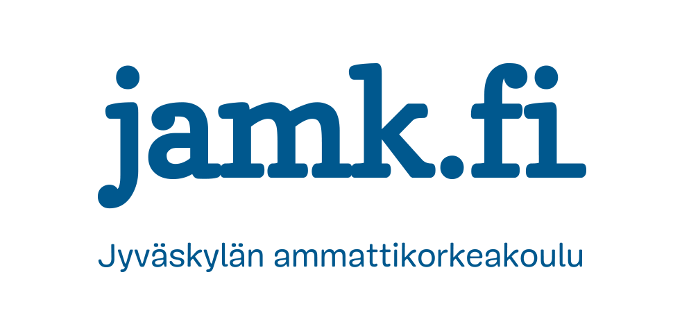

 

# Loppuraportti 

**Ticorporate**
**Pint.it**
**Versio 0.1**

         

**Tekijät**
Palenius Marcus

<!-- @import "[TOC]" {cmd="toc" depthFrom=1 depthTo=6 orderedList=false} -->

<!-- code_chunk_output -->

- [Loppuraportti](#loppuraportti)
	- [1. Projektin sisältö](#1-projektin-sis%C3%A4lt%C3%B6)
		- [1.1. Johdanto](#11-johdanto)
		- [1.2. Projektin tausta ja tavoitteet](#12-projektin-tausta-ja-tavoitteet)
		- [1.3. Tulos](#13-tulos)
	- [2. Projektin organisaatio](#2-projektin-organisaatio)
		- [2.2. Ohjausryhmä](#22-ohjausryhm%C3%A4)
		- [2.3. Työryhmät](#23-ty%C3%B6ryhm%C3%A4t)
	- [3. Projektin vaiheistus ja resursointi](#3-projektin-vaiheistus-ja-resursointi)
	- [4. Projektin suunnittelu ja seuranta](#4-projektin-suunnittelu-ja-seuranta)
	- [5. Kokemuksia ja oppeja, itsearviointi](#5-kokemuksia-ja-oppeja-itsearviointi)
		- [5.1. Lähtökohdat](#51-l%C3%A4ht%C3%B6kohdat)
		- [5.2. Määrittely ja suunnittelu](#52-m%C3%A4%C3%A4rittely-ja-suunnittelu)
		- [5.3. Toteutus](#53-toteutus)
		- [5.4. Testaus](#54-testaus)
		- [5.5. Projektikäytänteet](#55-projektik%C3%A4yt%C3%A4nteet)
		- [5.6. Aikataulut, raportointi ja projektiviestintä](#56-aikataulut-raportointi-ja-projektiviestint%C3%A4)
	- [6. Terveisiä ensi keväälle](#6-terveisi%C3%A4-ensi-kev%C3%A4%C3%A4lle)
	- [7. Projektiosaamisen arvioiminen](#7-projektiosaamisen-arvioiminen)

<!-- /code_chunk_output -->

| Muutoshistoria   | Päivämäärä |
| ---------------- | ---------- |
| Raportin alustus | 25.4.2019  |

**DOKUMENTTITIEDOT**

| Lyhennys | Materiaali |
| -------- | ---------- |
|          |            |

| Termi | Kuvaus |
| ----- | ------ |
|       |        |

## 1. Projektin sisältö

### 1.1. Johdanto

Seuraavassa dokumentissa on esiteltynä ja analysoituna Ticorporate 6-opintojakson projektityöskentelyn käytänteet sekä sen tuottama tulos että henkilökohtaisten oppimistavoitteiden toteutuminen. 

### 1.2. Projektin tausta ja tavoitteet

Projektin tarkoituksena oli ennen kaikkea luoda ymmärrystä projektityöskentelyn luonteesta sekä toimimisesta osana projektityöryhmää. Konkreettinen päämäärä oli luoda toimiva mobiilisovellus, joka tarjoaa loppukäyttäjälle olutkulttuurin ympärille rakennetun sosiaalisen median alustan. 

### 1.3. Tulos

Kaiken kaikkiaan projekti onnistui hyvin. Looputuotteeseen saatiin suurin osa suunnitelluista ominaisuuksista. Ainoastaan muutama suurempi ominaisuus (geolokaatio ja paikannus) jouduttiin karsimaan ajan loppumisen vuoksi.

Oppimisen näkökulmasta erityisesti testaajat kartuttivat sangen hyvän näkemyksen siitä, mitä testaus tarkoittaa sekä teknisesti että käytännössä. Sovelluskehittäjät syventivät näkemystään web-teknologioista. Kokonaisuutena ryhmä kartutti myös arvokasta taitoa projektidokumentaation kirjoittamisesta sekä erilaisten ihmisten kanssa työskentelystä.

## 2. Projektin organisaatio

### 2.2. Ohjausryhmä
| Nimi               | Vastuualue / Työnimike |
| ------------------ | ---------------------- |
| Ahlgren Riikka     | Lehtori                |
| Hanhela Janne      | Tuntiopettaja          |
| Immonen Jarkko     | Lehtori                |
| Kiviaho Niko       | Lehtori                |
| Miikkulainen Ilari | Lehtori                |
| Pölkki Teemu       | Laboratoriomestari     |
| Tuikka Tommi       | Lehtori                |

### 2.3. Työryhmät

| Jäsen           | Opiskelijanumero |
| --------------- | ---------------- |
| Laitinen Panu   | L4477            |
| Kätkä Kristian  | L9956            |
| Palenius Marcus | L4903            |
| Rukkila Samuli  | L4924            |
| Smal Antony     | M1630            |

## 3. Projektin vaiheistus ja resursointi
 
 <Tässä luvussa on tarkoitus tutkia kuinka projekti eteni ja miten työmäärä jakautui projektin eri vaiheisiin (sprintteihin).
Kuvatkaa vaiheiden aliluvuissa aina miten vaihe eteni ja millä aikataululla. Mikä meni juuri niin kuin oli tarkoitus ja mikä meni sitten hieman toisin? Mitä projekti tuotti kyseisissä vaiheissa? 
Työmäärien osalta kirjatkaa sprinteittäin ylös henkilökohtaiset työmäärät ja lopuksi kokonaisuus summattuna. Liittäkää työajanseurannasta listaukset raportin loppuun liiteeksi.

## 4. Projektin suunnittelu ja seuranta
<Tässä luvussa selvitetään kuinka projektia suunniteltiin ja kuinka suunnitelmia päivitettiin projektin edetessä. Mitä seurantamenetelmiä oli käytössä? Kuinka ja kenelle raportointiin?> 

## 5. Kokemuksia ja oppeja, itsearviointi

  
<Tässä luvussa on tarkoitus tutkia projektia osaamisen kehittymien näkökulmasta. Mitkä olivat projektin lähtökohdat ja ongelmat? Kuinka projekti toimi kokonaisuutena? Mitä opimme ja minkälainen projekti oli kokemuksena? Kysymykset ovat suuntaa antavia, joten tavoite ei ole vastata suoraan ko. kysymyksiin vaan niiden tarkoituksena on antaa näkökulmaa itsearviointiin. Loppupelissä jokaisen luvun tarkoituksena on kuvata miten tekijät onnistuivat ja mitä he matkallaan oppivat.>
### 5.1. Lähtökohdat
   <Kuvatkaa tähän mitkä olivat lähtökohdat projektille. Tunsitteko toisianne? Miltä alussa työhön ryhtyminen tuntui ja kuinka optimistiselta tavoitteiden saavuttaminen tuntui? Kuinka projekti lähti liikkeelle?>
### 5.2. Määrittely ja suunnittelu
   <Kuvatkaa kuinka mielestänne onnistuitte toteuttamaan järjestelmän määrittelyn  ja suunnittelun. Onko jatkokehitys helppo toteuttaa olemassa olevan dokumentaation valossa? Mitä projektista jää näiltä osin jäljelle ja onko se käyttökelpoista? Onko product ja sprint backlogeista jäljitettävissä projektin eteneminen?>
### 5.3. Toteutus

<Kuvatkaa sprinttien toteutusosia. Mitä hyvää ja mitä kehitettävää teknisestä näkökulmasta? Millaiseen lopputulokseen päädyttiin? Vastasiko lopputulos alussa ollutta visiota?>
### 5.4. Testaus

<Kirjatkaa auki näkemyksenne testauksesta. Kuinka testauksen suunnittelu toteutettiin? Oliko testitapauksille hyvät lähtökohdat määrittelyn/suunnittelun puolelta? Löydettiinkö bugeja? Kuinka bugien korjaus ja uudelleentestaus toteutettiin? Mitä kehitettävää näette projektinne testauskäytänteissä?>

### 5.5. Projektikäytänteet

<Kirjatkaa ylös näkemyksenne prosessin toimivuudesta. Missä onnistuitte ja missä olisi kannattanut  toimia toisin kun nyt toimitte:
Daily Scrums:
Demo- ja suunnittelupäivät:
Retrospektiivit:
Katselmoinnit:
Viikkopalaverit:>

### 5.6. Aikataulut, raportointi ja projektiviestintä

<Kuvatkaa tässä kuinka projektiviestintä mielestänne toteutettiin. Toteutettiinko sitä sopimusten mukaisesti? Miten arvioitte päätösten ja sopimusten jäljitettävyyttä eli löytyykö sopimuksista aina asiakkaan hyväksyntä jne. Kuinka projektin sisäinen viestintä toimi? Entä ulkoinen, asiakkaaseen suuntautuva viestintä?
Kuinka suunnitelmallisia sprinttinne olivat? Oliko sprinteillä selkeät tavoitteet joihin tähdättiin? Pysyttiinkö aikataulussa? Kuinka projektin etenemistä raportoitiin sidosryhmille? >

## 6. Terveisiä ensi keväälle

<Ensi keväänä projektiopintoihin osallistuva ikäluokka toteuttaa tuoteprojekteja. Mihin asioihin kiinnittäisitte erityisesti huomiota projektiopintoja toteutettaessa? Mitkä asiat tuntuivat teistä haastavimmilta ja mihin asioihin kaipaisitte enemmän apua kun mitä koulutusohjelma kykeni antamaan?>

## 7. Projektiosaamisen arvioiminen

<Millainen ajatus ja osaamisen taso ryhmällä on projektina toteutettavan työsuorituksen toteuttamisesta? Millaiset valmiudet koette omaavanne projektin toteuttamiselle?>