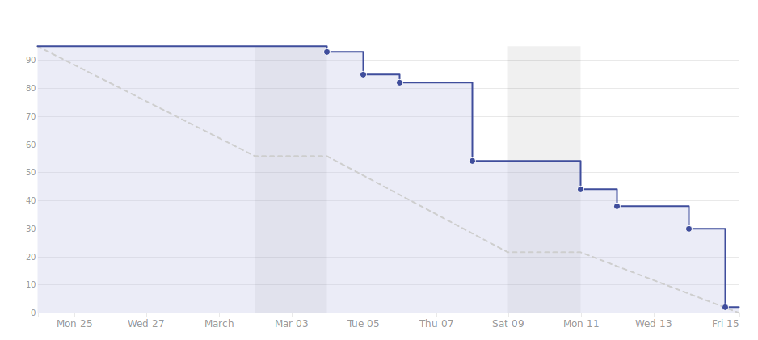

# Viikkoraportti
## Viikko 11
### Lyhyesti

Ohjelmointi edistyy hyvin. Olemme saaneet tehtyä Sequelizen avulla toteutettuja get-kyselyjä. Sovelluksessa tämä tarkoittaa sitä, että saamme backendissa olevat postaukset näkymään käyttäjälle sekä suodatettua ja järjesteltyä niitä. Testauksen osalta automaatioympäristö on konfiguroitu ja voimme aloittaa testiskriptien tekemisen.

## 3. Edellinen viikko	

Työntekijä | Työn kuvaus | Tunnit
-----|-----|-----
Marcus | **Ma:** Dokumentointi, Testien hyväksymiskriteerit   **Ti:** Testien hyväksymiskriteerit   **Ke-Pe:** Testiautomaation konfiguraatio ja ymmärtäminen, QA-putki | 31.75
Panu | **Ma:** Etäpäivä   **Ti-Ke:** Testien hyväksymiskriteerit   **To-Pe:** Pythonin opiskelua, QA-putki | 30.17
Christian | **Ma:** Mock-datan tekeminen, Sequelizen funktioden tekoa, backendin koodausta (profiilinäkymä)   **Ti-To:** Käyttäjän profiilin back-end + front-end   **Pe:** Kehitysympäristön konfigurointi (mm. aliakset), koodin kommentointi, koodin selkeyttäminen  | 32.17
Antony | **Ma:** Dokumentointi, Testien hyväksymiskriteerit, Kehitysympäristön configurointi   **Ti-Ke:** Testien hyväksymiskriteerit   **To-Pe:** Kehitys sekä testiympäristön  configurointi, QA-putki | 32.17
Samuli | **Ma:** Mock-data, Sovelluksen etusivun back-end + front-end    **Ti-Pe:** Sovelluksen etusivun back-end + front-end | 38.78		

## 4. Seuraava viikko	

Työntekijä | Tehtävä työ
-----|-----
Samuli | **Ma:** Postauksen visualisointi    **Ti-Pe:** TBD
Christian | **Ma:** Käyttäjän front-end +back-end putki   **Ti-Pe:** TBD
Antony | **Ma:** Dokumentointi, Sprint planning   **Ti-Pe:** TBD
Panu | **Ma:** Sprint planning, QA-putki   **Ti-Pe:** TBD
Marcus | **Ma:** Dokumentointi, Sprint planning, testiautomaatio   **Ti-Pe:** TBD

#### Kooste tunneista koko projektin osalta

Työntekijä | Tunnit
---|---
Antony | 154.26
Christian | 140.67
Marcus | 152.08
Panu | 150.34
Samuli | 148.53

#### Aikataulu

#### Ongelmat ja riskit

Nativescript poistettu riskeistä, koska osaaminen on nyt sillä tasolla, ettei se häiritse projektityöskentelyä. Riskicharttiin ei ole toistaiseksi ilmestynyt mitään uutta.

Kuvaus | Todennäköisyys | Vaikutus | Kokonaisvaikutus
----|----|----|----
Automaatiotestausympäristö ei toimi odotusten mukaisesti | 3 | 3 | Aikaa menee konfiguraatioon itse testauksen toteuttamisen sijaan

#### Yleiset asiat ja tiedotukset

Tiistaina Christianilla on englannin kurssi klo 13.15 - 15.45.

Keskiviikkona Concept Lab vie meiltä työajan klo 13.15 - 16.00 välillä

Laitinen mahdollisesti poissa perjantaina, vielä ei varmuutta