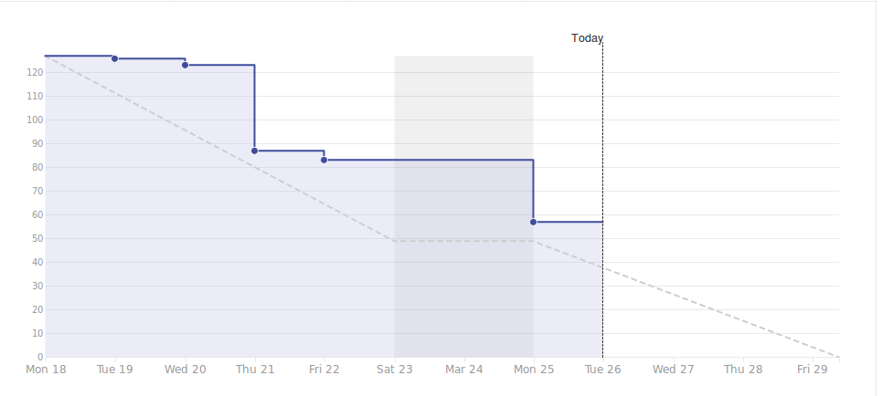

# Viikkoraportti
## Viikko 12
### Lyhyesti

Olemme pysyneet aikataulussa erittäin hyvin, vaikka pieniä ongelmia on tullut vastaan mm. automaatiotestauksen kohdalla sekä postauksen kuvan lisäämisen kohdalla. Tämän viikon aiheena on demon viimeistely ja siihen valmistautuminen, jotta perjantai sujuisi mahdollisimman mutkitta.

## 3. Edellinen viikko	

Työntekijä | Työn kuvaus | Tunnit
-----|-----|-----
Marcus | **Ma:** Palaveri, Dokumentointi, Automaatiotestaaminen   **Ti:** Automaatiotestaaminen & testiympäristön conffaus   **Ke:** Määrätyt palaverit   **To:** QA-putki, Automaatiotestaus   **Pe:** Backendissä kuvan vastaanotto (multer) | 27.42
Panu | **Ma:** Viikkopalaveri, Sprint planning day, QA-putki   **Ti-To:** Backend tehtävien suorittaminen ZenHubista   **Pe:** TikoBiz pitch, QA-putki | 30.42
Christian | **Ma:** Viikkopalaveri, Ohjelmakoodin kommentointi, Profiilisivun bion putki (Front <-> back <-> Kanta)   **Ti:** Toisen profiiliin navigointi frontendissä (routing)   **Ke:** Postausten kuvien lisääminen ja muokkaaminen   **To-Pe:** CreatePost lomakkeen suunnittelu ja tekeminen  | 29.08
Antony | **Ma:** Viikkopalaveri, Raportointi, Sprint planning day, ZenHub Taskien suunnittelu    **Ti:** Toisen profiiliin navigointi frontendissä (routing)   **Ke:** Pakollista palaveeraamista   **To-Pe:** QA-putki, Apukäsi | 31.25
Samuli | **Ma:** Viikkopalaveri, Sprint planning day, ZenHub Taskien suunnittelu    **Ti-To:** CreaPost lisätiedot lomakkeen suunnittelu ja toteutus   **Pe:** Createpost teknisen logiikan aloittaminen (backend) | 37.17	

## 4. Seuraava viikko	

Työntekijä | Tehtävä työ
-----|-----
Samuli | **Ti-Ke:** CreatePost lomakkeen toiminnan viimeistely (front+back)    **To:** Demon viimeistely & Suunnittelu   **Pe:** Demon esittäminen & Retrospektiivi
Christian | **Ti-Ke:** Backend; Notifikaation lukeminen    **To:** Demon viimeistely & Suunnittelu   **Pe:** Demon esittäminen & Retrospektiivi
Antony | **Ti:** Raportointi, Viikkopalaveri, TBD   **Ke:** Demon rakenteen suunnittelu    **To:** Demon viimeistely & Suunnittelu   **Pe:** Demon esittäminen & Retrospektiivi
Panu | **Ti** Viikkopalveri, Bändisopimus, Asiakaskyselyn toteuttaminen   **Ke:** TBD   **To:** Demon viimeistely & Suunnittelu   **Pe:** Demon esittäminen & Retrospektiivi
Marcus | **Ti** Viikkopalveri, Raportointi, Bändisopimus, Asiakaskyselyn toteuttaminen & analysointi   **Ke:** TBD    **To:** Demon viimeistely & Suunnittelu   **Pe:** Demon esittäminen & Retrospektiivi

#### Kooste tunneista koko projektin osalta

Marcus: 235.92
Panu: 241.25
Antony: 248.42
Samuli: 246.78
Christian: 223.33

#### Aikataulu

#### Ongelmat ja riskit

Automaattisiin testeihin tulee NativeScriptin identifikaattorien puutteen takia lisätä uudet bounds-koordinaatit aina, kun ohjelma käännetään .apk-tiedostoksi.

Kuvaus | Todennäköisyys | Vaikutus | Kokonaisvaikutus
----|----|----|----
Automaatiotestausympäristö ei ole suoraan yhteensopiva sovelluskehyksen kanssa | 5 | 2 | Testien kirjoittamiseen kuluu enemmän aikaa

#### Yleiset asiat ja tiedotukset

Tiistaina Christianilla on englannin kurssi klo 13.15 - 15.45.

Keskiviikkona Concept Lab vie meiltä työajan klo 13.15 - 16.00 välillä