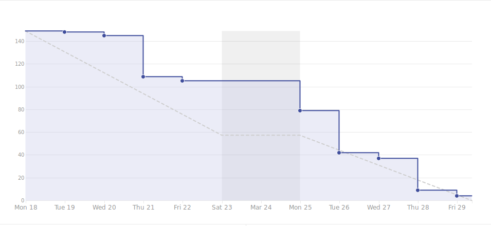

# Viikkoraportti
## Viikko 12
### Lyhyesti

Valmistauduimme viime viikolla demoon, joka meni hyvin. Tällä viikolla testaustiimi keskittyy AC-testien tekoon. Automaatio tekee joitakin asioita puolestamme, mutta manuaalitestausta tarvitaan myös.

## 3. Edellinen viikko	

Työntekijä | Työn kuvaus | Tunnit
-----|-----|-----
Marcus |    **Ma:** Automaatiotestaaminen   **Ti:** Viikkopalveri, Raportointi, Bändisopimus, Asiakaskyselyn toteuttaminen & analysointi   **Ke:** Automaatiotestaaminen   **To:** Automaatiotestit demoa varten   **Pe:** Demopäivä, Retrospektiivi | 32.92
Christian | **Ma:** CreatePostin siistiminen, Ohjelmakoodin siistiminen, Postauksen tallentaminen tietokantaan (backend), Notifikaation lukeminen (backend)   **Ti:** Viikkopalaveri, SQL-mockadatan muokkaaminen, ZenHub taskien uudelleen kirjoitus, Notifikaation service   **Ke:** Notifikaatio; Saapuvan datan lukeminen   **To:** Notifikaatiosivun toiminta, SQL-Mockdatan muokkaaminen   **Pe:** Demopäivä, Retrospektiivi | 30.33
Antony |    **Ma:** Pariohjelmointi   **Ti:** Viikkopalaveri, Raportointi, Pariohjelmointi   **Ke:** Demo pptx   **To:** Demon viimeistely   **Pe:** Demopäivä, Retrospektiivi | 31.00
Samuli |    **Ma-To:** CreatePost sivun ulkoasun muokkaaminen, Kuvan vastaanottaminen ja lähettäminen   **Pe:** Demopäivä, Retrospektiivi | 34.42
Panu |      **Ti:** Viikkopalaveri, Projektisopimus, Asiakaskyselyn toteutus & Analysointi, Pitch   **Ke:** Pitchin harjoittelu   **To:** Demon suunnittelu   **Pe:** Demopäivä, Retrospektiivi | 31.33

## 4. Seuraava viikko	

Työntekijä | Tehtävä työ
-----|-----
Samuli |    **Ma-To:** Sovellukseen kirjatuminen, rekisteröityminen (social+tavallinen) frontend & backend   **Pe:** TBD
Christian | **Ma:** ZenHub taskien teko   **Ti-Pe:** Sovelluksen kommentointi (epic)
Antony |    **Ma:** Raportointi   **Ti-Ke:** Automaatiotestaaminen
Panu |      **Ma:** Pitch   **Ti-Ke:** Automaatiotestaaminen
Marcus |    **Ma:** Raportointi   **Ti-Ke:** Automaatiotestaamisen opettaminen

#### Kooste tunneista koko projektin osalta

Marcus: 273.42
Panu: 272.58
Antony: 279.42
Samuli: 293.20
Christian: 265.67

#### Aikataulu

#### Ongelmat ja riskit

Automaattisiin testeihin tulee NativeScriptin identifikaattorien puutteen takia lisätä uudet bounds-koordinaatit aina, kun ohjelma käännetään .apk-tiedostoksi.

Jatkossa sovelluskehityksessä painopiste pyritään pitämään nissä ominaisuuksissa, jotka erottavat meidät muista sosiaalisista medioista. Pyrimme priorisoimaan kehitettävät ominaisuudet backlog groomingin avulla.

Kuvaus | Todennäköisyys | Vaikutus | Kokonaisvaikutus
----|----|----|----
Automaatiotestausympäristö ei ole suoraan yhteensopiva sovelluskehyksen kanssa | 5 | 2 | Testien kirjoittamiseen kuluu enemmän aikaa
Aika loppuu kesken | 2 | 4 | Sovellukseen ei saada kaikkia haluttuja ominaisuuksia
Sovellukseen ei saada tarpeeksi olueen liittyviä ominaisuuksia | 3 | 4 | Sovellus jää tavalliseksi sosiaaliseksi mediaksi

#### Yleiset asiat ja tiedotukset

Tiistaina Christianilla on englannin kurssi klo 13.15 - 15.45.

Keskiviikkona Concept Lab vie työajan klo 13.15 - 16.45 välillä