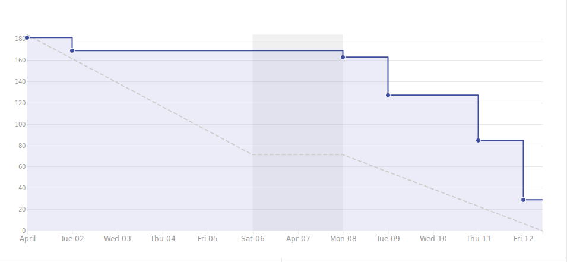

# Viikkoraportti
### Lyhyesti

Allekirjoittanut oli koko edeltävän viikon sairaana. Projekti on silti edistynyt hyvin, mutta ominaisuuksia on nyt karsittu lähestyvän deadlinen takia. Tarkoituksena on saada kaikki kehitystyö päätökseen tämän viikon torstaiksi. Ensi viikolla luvassa on ohjelmistovikojen ja bugien korjaamista. Sairaspoissaolon takia automaatiotestaus jätetään nyt sivuun ja keskitytään erityisesti backendin testaamiseen chai-kirjastolla.

## 3. Edellinen viikko	

Työntekijä | Työn kuvaus | Tunnit
-----|-----|-----
Christian   | Loman takia joudutaan jättämään merkkaamatta    | 30.08
Marcus      | **Ma:** Viikkopalaveri, Raportointi   **Ti-Pe:** Sairaana | 30.00
Panu        | **Ma:** Viikkopalaveri, Työympäristön konfaaminen   **Pe:** Työympäristön konfauksen viimeistely, Pariohjelmointi; Salasanan vaihtaminen sovellukseen | 29.25
Samuli      | **Ma:** Viikkopalaveri, Asetusvalikko; Profiilin muokkaaminen (kuva ja bio) backend + frontend   **Ti:** Asetusvalikko; Profiilin muokkaaminen (kuva ja bio) backend + frontend   **Ke:** Notifikaatio-modelin muokkaaminen   **To:** Preview-model luonti => Notifikaation painaminen avaa uuden modaalin   **Pe:** Pariohjelmointi; Salasanan vaihtaminen sovellukseen | 32.25
Antony      | **Ma:** Viikkopalaverin, Dokumentointi, QA-putki, Panun tekninen tukihenkilö   **Ti:** Frontendin automaatiotestaamisen taustatyötä, QA-putki   **Ke-Pe:** Mocha+Chai testit, QA-putki | 38.67

## 4. Seuraava viikko	

Työntekijä | Tehtävä työ
-----|-----
Antony      | **Ma:** Viikkopalaverin dokumentointi, Sprintin suunnittelu   **Ti-Pe:** TBD
Samuli      | **Ma:** Sprintin suunnittelu   **Ti-Pe:** TBD
Panu        | **Ma:** Sprintin suunnittelu   **Ti-Pe:** TBD
Christian   | **Ma:** Lomailua   **Ti-Pe:** TBD
Marcus      | **Ma:** Viikkopalaverin raportointi, Sprintin suunnittelu   **Ti-Pe:** TBD

### Kooste tunneista koko projektin osalta

Marcus: 331.92
Panu: 332.33
Antony: 346.17
Samuli: 364.87
Christian: 326.92

#### Aikataulu

#### Ongelmat ja riskit

Kuvaus | Todennäköisyys | Vaikutus | Kokonaisvaikutus
----|----|----|----
Aika loppuu kesken | 3 | 3 | Sovelluksen ominaisuuden kärsivät

## 6. Muut asiat

Christian lomalla maanantaina ja tiistaina englantia 13.15 eteenpäin.

Antony & Marcus lomalla torstaina.

Samuli lähtee haastatteluun tänään, maanantaina, yhdeksi.