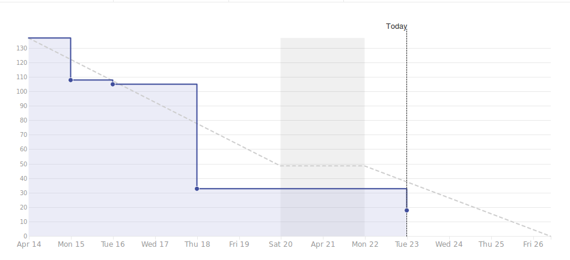

# Viikkoraportti
### Lyhyesti

Pääsiäisviikko lyhensi edellistä viikkoa päivällä, osa ryhmästä otti myös torstain vapaaksi. Ylipäätään kehitystyö on nyt saatu päätökseen ja jäljellä on enää produktioalustan konfigurointi, bugien korjaus ja demo. SM kiittää ja kuittaa.

## 3. Edellinen viikko	

Työntekijä | Työn kuvaus | Tunnit
-----|-----|-----
Christian   | **Ma:** Lomalla   **Ti:** Viikkopalaveri, Tykkää-napin toiminta + luo notifikaatio tykkäämisestä   **Ke:** Tykkää postauksesta käyttäjän profiili-sivulla   **To:** Tykkää-toiminnon viimeistely + koodin kommentoi| 32.42
Marcus      | **Ma:** Mocha-scriptit   **Ti:** Viikkopalaveri, Raportointi, Mocha-scriptit   **Ke:** Mocha-scriptit   **To:** Lomalla | 31.00
Panu        | **Ma:** QA-putki, Mocha-scriptit  **Ti:** Viikkopalaveri, QA-putki, Mocha-scriptit   **Ke:** QA-putki, Mocha-scriptit   **To:** QA-putki | 28.50
Samuli      | **Ma:** Kommentista tykkääminen (frontend+backend)   **Ti-Ke:** Viikkopalaveri, Sama ku krisulla, Postauksen hidden value, Pariohjelmointi panun kanssa   **To:** Headers-lisääminen http-kyselyihin, backendin siirto heroku-palvelun | 39.25
Antony      | **Ma:** Mocha-scriptit   **Ti:** Viikkopalaveri, dokumentointi,  QA-putki, Mocha-scriptit   **Ke:** QA-putki, Mocha-scriptit   **To:** Lomalla | 30.17

## 4. Seuraava viikko	

Työntekijä | Tehtävä työ
-----|-----
Antony      | **Ti:** Viikkopalaveri, Dokumentointi   **Ke:** Demo-esityksen suunnittelu ja harjoittelu   **To:** Demo-esityksen suunnittelu ja harjoittelu   **Pe:** Demon esitys, Retrospektiivi
Samuli      | **Ti:** Viikkopalaveri, Backendistä tulevien kuvien siirto pilvipalveluun   **Ke:** Backendistä tulevien kuvien siirto pilvipalveluun, Bugien korjaus   **To:** Demo-esityksen suunnittelu ja harjoittelu   **Pe:** Demon esitys, Retrospektiivi
Panu        | **Ti:** Viikkopalaveri, TikoBiz, Wordpress   **Ke:** Wordpress   **To:** Demo-esityksen suunnittelu ja harjoittelu   **Pe:** Demon esitys, Retrospektiivi
Christian   | **Ti:** Viikkopalaveri, bugien korjaus   **Ke:** Bugien korjaus   **To:** Bugien korjaus, Demo-esityksen suunnittelu   **Pe:** Demon esitys, Retrospektiivi
Marcus      | **Ti:** Viikkopalaveri, Raportointi, Manuaalitestien teko   **Ke:** Manuaalitestien teko, Bugien korjaus   **To:** Bugien korjaus, Demo-esityksen suunnittelu   **Pe:** Demon esitys, Retrospektiivi

### Kooste tunneista koko projektin osalta

Marcus: 362.92
Panu: 360.83
Antony: 376.33
Samuli: 404.12
Christian: 359.33

#### Aikataulu

#### Ongelmat ja riskit

Kuvaus | Todennäköisyys | Vaikutus | Kokonaisvaikutus
----|----|----|----
Aika loppuu kesken | 3 | 3 | Sovelluksen ominaisuuden kärsivät

## 6. Muut asiat

Ei mainittavaa.
