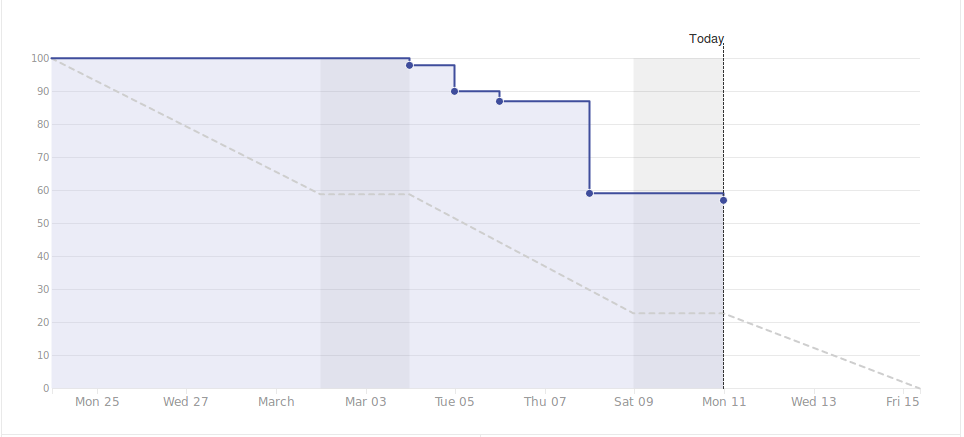

# Viikkoraportti
## Viikko 10
### Lyhyesti

Viime viikolla backendin Express-palvelin saatiin alustettua. Ryhmä mietti hakemistorakennetta, kirjastotarvetta ja muuta. Lisäksi puskimme mockdataa tietokantaan SQL-kyselyin. Ryhmä myös käytti aikaa muutaman jäsenen perehdyttämiseen Sequelize-mallien kirjoittamiseen. Lisäksi testaajat osallistuivat akvaariokeskusteluun. Sairastapauksia on yhä ollut, joista on kertynyt poissaoloja.

**Edellinen viikko**

Työntekijä | Työn kuvaus | Tunnit
-----|-----|-----
Antony | **Ma:** Sprintin suunnittelu, ZenHubin järjestely, dokumentointi   **Ti-Pe:** Sairaana  | 31.08 (7:50 todellinen)
Christian | **Ma:** Sprintin suunnittelu   **Ti-Ke:** Express luuranko, Seq modelien aloittaminen   **To:** Android Studion & sen emulaattorin configurointi  **Pe:** Mock-datan luonti | 24.25
Marcus | **Ma:** Sprintin suunnittelu, Testauksen kirja   **Ti:** Testauksen kirja   **Ke:** Testauksen miitti   **To:** Seq opettaminen muille, Review/QA tehtävät   **Pe:** Review/QA tehtävät, Mock-dataa  | 30.08
Panu | **Ma:** Sprintin suunnittelu, TikoBiz tehtäviä   **Ti-To:** Avusti muita muiden työtehtävissä (ei paikalla tarkentamassa)   **Pe:** Mock-datan luonti   | 30.17
Samuli | **Ma:** Sprintin suunnittelu   **Ti-Ke:** Express luuranko, Seq modelien aloittaminen   **To:** Tietokannan optimointi (ER), Asetus-sivun suunnittelu (list-view)   **Pe:** Mock-datan luonti  | 30.25

**Seuraava viikko**

Työntekijä | Tehtävä työ
-----|-----
Antony | **Ma:** Mock-data, dokumentointi, kehitysympäristön asennus   **Ti:**   **Ke:**   **To-pe:** TBD
Christian | **Ma:** Mock-data, TBD   **Ti-pe:** TBD
Marcus | **Ma:** Mock-data, dokumentointi, kehitysympäristön asennus   **Ti-pe:** TBD
Panu | **Ma-Pe:** TBD
Samuli | **Ma:** Mock-data, TBD   **Ti-pe:** TBD

**Työtunnit yhteensä**

Työntekijä | Tunnit
---|---
Antony | 185.00
Christian | 164.08
Marcus | 176.74
Panu | 180.67
Samuli | 170.83

**Riskit**

Kuvaus | Todennäköisyys | Vaikutus | Kokonaisvaikutus
----|----|----|----
Taskit eivät jaukaudu tasaisesti ryhmän jäsenten kesken niin että jokainen voisi oppia monipuolisesti oman opiskelusuuntauksen mukaisesti | 3 | 3 | Voi vaikuttaa ryhmän jäsenten haluun toimia projektissa
Riittävän tekninen osaaminen puute; NativeScript | 2 | 5 | Sovelluksemme front-end perustuu NativeScriptin ympärille, joten ilman riittävää osaamista emme voi rakentaa sovellusta suunnitelmien mukaisesti, vaan joudumme miettimään matalamman kynnyksen ratkaisuja.
Sairastapaukset jatkuvat | 3 | 3 | Etenkin testaus kärsii, koska sairastelevat ovat olleet QA-tiimin jäseniä.

#### Yleiset asiat ja tiedotukset

- Laitinen poissa toistaiseksi.