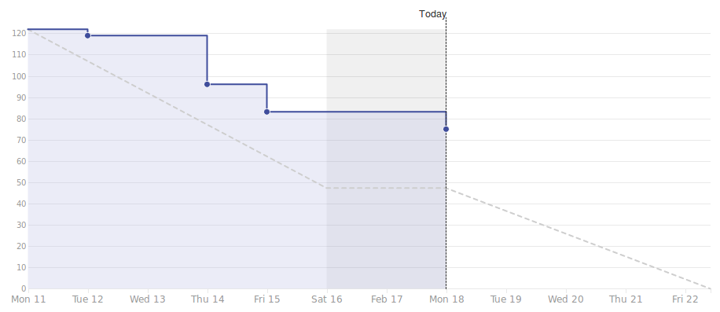

# Viikkoraportti
## Viikko 7
### Lyhyesti

Viikon vierailijaluentojen ja concenpt labin vuoksi dokumentointi venyi loppuviikkoon. Muuten ryhmä kokee työn edistyneen hyvin etenkin nyt, kun dokumentointi on valmis ja kaikki voivat keskittyä oman alansa tekniikkaan.

#### 3. Edellinen viikko	
Työntekijä | Työn kuvaus | Tunnit
-----|-----|-----
Antony | **Ma:** Raportointia    **Ti:** HLTP   **To - Pe:** HLTP | 35.42
Christian | **Ma:** Sequalize   **Ti - Ke:** Sairaana   **To - Pe:** Alustavaa Ilmoitukset-sivun tekoa | 27.17
Marcus | **Ma:** Raportointia   **Ti:** HLTP   **To - Pe:** HLTP  | 31.08
Panu | **Ma - To:** Sairaana   **Pe:** HLTP, TikoBiz taskeja  | 30.00
Samuli | **Ma:** Sequelize opiskelu   **Ti - Pe:** Mobiilisovelluksen etusivun tekoa  | 28.67

#### Tulevan viikon suunnitelma

Työntekijä | Tehtävä työ
-----|-----
Antony | **Ma:** Demon suunnittelu, raportointi   **Ti - Ke:** Testaamisen opiskelu    **To:** Demon tilanteen tarkistus ja viimeistely   **Pe:** Demon esittäminen + TBD
Christian | **Ma - Ke:** Ilmoitukset-sivun tekeminen (Front-end)   **To - Pe:** TBD
Marcus | **Ma:** Demon suunnitelu, Raportointi   **Ti - Ke:** Testauksen opiskelu   **To - Pe:** Matkoilla
Samuli | **Ma:** Demon suunnitelu & Toteutus   **Ti - Ke** JOS demo ok => Postaukseen ominaisuuksia; Näytä lisää-painike, Tykkääminen, Näytä Kommentit-ominaisuus   **To:** Demon viimeinen check + Ti-Ke työ   **Pe:** TBD
Panu | **Ma:** Demon suunnitelu, TikoBiz   **Ti - Ke:** Testauksen opiskelua   **To:** Demon viimeistely   **Pe:** TBD

#### Kooste tunneista koko projektin osalta

Työntekijä | Tunnit
---|---
Antony | 122.09
Christian | 108.5
Marcus | 120.33
Panu | 120.17
Samuli | 109.75

#### Aikataulu

#### Ongelmat ja riskit

Riskinhallintasuunnitelmamme onnistui käytännössä. Riskit ovat pysyneet vielä toistaiseksi samana. NativeScriptin osalta tekniikkaan perehtyvät kokevat olonsa mukavammaksi, kun heille suunnitelman mukaisesti alettiin antamaan enemmän aikaa.

Kuvaus | Todennäköisyys | Vaikutus | Kokonaisvaikutus
----|----|----|----
Taskit eivät jaukaudu tasaisesti ryhmän jäsenten kesken niin, että jokainen voisi oppia monipuolisesti oman opiskelusuuntauksen mukaisesti | 3 | 3 | Voi vaikuttaa ryhmän jäsenten haluun toimia projektissa
Riittävän tekninen osaaminen puute; NativeScript | 2 | 5 | Sovelluksemme front-end perustuu NativeScriptin ympärille, joten ilman riittävää osaamista emme voi rakentaa sovellusta suunnitelmien mukaisesti, vaan joudumme miettimään matalamman kynnyksen ratkaisuja.

#### Yleiset asiat ja tiedotukset

Tiistaina Christianilla on englannin kurssi klo 13.15 - 15.45.

Keskiviikkona Concept Lab vie meiltä työajan klo 13.15 - 16.00 välillä

Palenius matkoilla alkaen torstaina ~12:00.